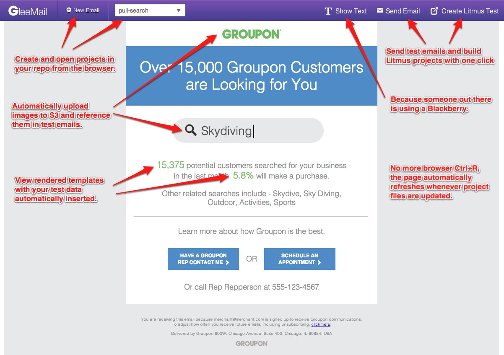

# Gleemail

*Remember when developing HTML emails used to be fun?* **Nope, neither do I.**

Gleemail is an attempt to change that. It's a local development environment for creating HTML emails that removes a lot of the headaches.



## Features

* Build email templates with [Mustache](http://mustache.github.io/).
* Write CSS using [Stylus](http://learnboost.github.io/stylus/).
* Custom Gleemail HTML tags cleanly render into unsightly nested table structures.
* Automatically inlines CSS styles for you.
* Export templates to other templating engines (MailChimp, Eloqua, FreeMarker, etc.)
* Share Mustache and Stylus partials between email templates.
* Live browser preview refreshes whenever you save changes to files.
* View both HTML and text previews of an email in the browser.
* Automatically upload images to S3, automatically reference them in test emails.
* One-click test email delivery.
* One-click project creation in Litmus and Eloqua.
* Automatically render templates with dummy data from a JSON file.
* CLI for rendering templates from the command line.

## Getting Started

Install Node.js, then install the `gleemail` npm package globally:

```shell
npm install -g gleemail
```

Create a new project directory:

```shell
gleemail project my-project-dir-name
```

Edit `config.json` with your email, [S3](http://aws.amazon.com/s3) and [Litmus](https://litmus.com) credentials, then start the server:

```shell
cd ./my-project-dir-name
gleemail start
```

Now you should be able to visit http://localhost:4433 *in Chrome* and you will be able to see the example email template.
Use the UI to bootstrap your own templates, and the changes you make will be immediately displayed in the browser.

## Rendering from the Command Line

To programmatically render templates in a script or from the command line, use the `gleemail render` command:

```shell
cd /path/to/project

# Render the HTML version with the first dummy data to stdout
gleemail render your-template-name > my-email.html

# Render using the third piece of dummy data
gleemail render your-template-name -i 2 > my-email.html

# Render the text version, use -o to specify output instead of stdout
gleemail render your-template-name -t text -o my-email.txt

# Render as a Mailchimp template
gleemail render your-template-name -r mailchimp > my-email.html
```

To view all the available rendering options, use `gleemail help render`.

## Gleemail Markup

For all of these transformer "macro tags", any regular attributes (`id`, `class`, etc) that are placed on the macro element will be transferred to the generated element.

### `<gm-box>`

This gives you a box model for padding around a piece of content using table cells.

```html
<gm-box padding="10px 20px" class="some-class">
  <strong>Hello World</strong>
</gm-box>

<!-- becomes -->

<table class="some-class" style="width: 100%; border: none; border-collapse: collapse;" cellspacing="0" cellpadding="0" border="0">
  <tr style="border: none; border-collapse: collapse;">
    <td style="line-height: 0; border: none; border-collapse: collapse;" height="10" width="20">&nbsp;</td>
    <td style="line-height: 0; border: none; border-collapse: collapse;" height="10">&nbsp;</td>
    <td style="line-height: 0; border: none; border-collapse: collapse;" height="10" width="20">&nbsp;</td>
  </tr>
  <tr style="border: none; border-collapse: collapse;">
    <td style="line-height: 0; border: none; border-collapse: collapse;" width="20">&nbsp;</td>
    <td style="border: none; border-collapse: collapse;">
      <strong>Hello World</strong>
    </td>
    <td style="line-height: 0; border: none; border-collapse: collapse;" width="20">&nbsp;</td>
  </tr>
  <tr style="border: none; border-collapse: collapse;">
    <td style="line-height: 0; border: none; border-collapse: collapse;" height="10" width="20">&nbsp;</td>
    <td style="line-height: 0; border: none; border-collapse: collapse;" height="10">&nbsp;</td>
    <td style="line-height: 0; border: none; border-collapse: collapse;" height="10" width="20">&nbsp;</td>
  </tr>
</table>
```

### `<gm-stack>`

This gives you a vertical stack of elements. Each child of the `<gm-stack>` is assumed to be its own row.

```html
<gm-stack class="some-class">
  <p>Hello</p>
  <p>World</p>
  <p>!!!</p>
</gm-stack>

<!-- becomes -->

<table class="some-class" cellspacing="0" cellpadding="0" border="0">
  <tr style="border: none; border-collapse: collapse;">
    <td style="border: none; border-collapse: collapse;">
      <p>Hello</p>
    </td>
  </tr>
  <tr style="border: none; border-collapse: collapse;">
    <td style="border: none; border-collapse: collapse;">
      <p>World</p>
    </td>
  </tr>
  <tr style="border: none; border-collapse: collapse;">
    <td style="border: none; border-collapse: collapse;">
      <p>!!!</p>
    </td>
  </tr>
</table>
```

### `<gm-row>` with `<gm-col>`

Using `<gm-row>` with nested `<gm-col>` elements gives you horizontally aligned content.
Attributes placed on the `<gm-col>` elements are transferred to the generated `<td>`s.

```html
<gm-row class="some-class">
  <gm-col width="100">Hello</gm-col>
  <gm-col width="200">World</gm-col>
  <gm-col width="300">!!!</gm-col>
</gm-row>

<!-- becomes -->

<table class="some-class" cellspacing="0" cellpadding="0" border="0">
  <tr style="border: none; border-collapse: collapse;">
    <td width="100" style="border: none; border-collapse: collapse;">
      Hello
    </td>
    <td width="200" style="border: none; border-collapse: collapse;">
      World
    </td>
    <td width="300" style="border: none; border-collapse: collapse;">
      !!!
    </td>
  </tr>
</table>
```

### `gm-centered` Attribute

This attribute can be added to any tag to wrap its contents in a centered table.
This is primarily useful on the `<body>` element.

```html
<body gm-centered>
  <p>My body</p>
</body>

<!-- becomes -->

<body>
  <table style="width: 100%;" cellspacing="0" cellpadding="0" border="0">
    <tr style="border: none; border-collapse: collapse;">
      <td align="center" style="border: none; border-collapse: collapse;">
        <p>My body</p>
      </td>
    </tr>
  </table>
</body>
```

### Creating Custom Transformer Macros

To write your own macros, add a `hooks.js` or `hooks.coffee` file to your project directory.
It should export a function that take a `hooks` object, which has a number of methods on it including `addTransformer()`.
Transformer functions can be synchronous or asynchronous, and this is determined by the presence of a second argument in the function signature.

For example:

```javascript
// This is hooks.js

module.exports = function(hooks) {
  // Simple, synchronous macro
  // Turns:
  // <gm-green>This is green!</gm-green>
  // into:
  // <span style='color: green;'>This is green!</span>
  hooks.addTransformer(function($) {
    $("gm-green").each(function() {
      greenTag = $(this);
      span = $("<span style='color: green;'></span>");
      span.append(greenTag.contents());
      greenTag.after(span);
      greenTag.remove();
    });
  });

  // Asynchronous macro, requires passing $ back in the callback
  // Turns:
  // <gm-file path="/path/to/file.txt"></gm-file>
  // Into:
  // <pre>Contents of file...</pre>
  hooks.addTransformer(function($, cb) {
    fileTag = $("gm-file").eq(0); // for simplicity, let's say there's just one
    pre = $("<pre></pre>");
    filePath = fileTag.attr("path");
    require("fs").readFile(filePath, function(err, buffer) {
      if (err) return cb(err);
      pre.html(buffer.toString());
      fileTag.after(pre);
      fileTag.remove();
      cb(null, $);
    });
  });
});
```

# Development

Please refer to `CONTRIBUTING.md` for contribution guidelines, any help is greatly appreciated!

After cloning the repository, do a setup and run the tests:

```shell
make setup
make test
```

The easiest way to use the `gleemail` command during development is to use the `npm link` command.
This makes your local executable available as if you had installed it globally from npm:

```shell
npm link .
```

To make development easier, you can use these commands to auto-load changes in client and server code:

```shell
# In gleemail dir
make dev
# In project dir
gleemail dev
```
